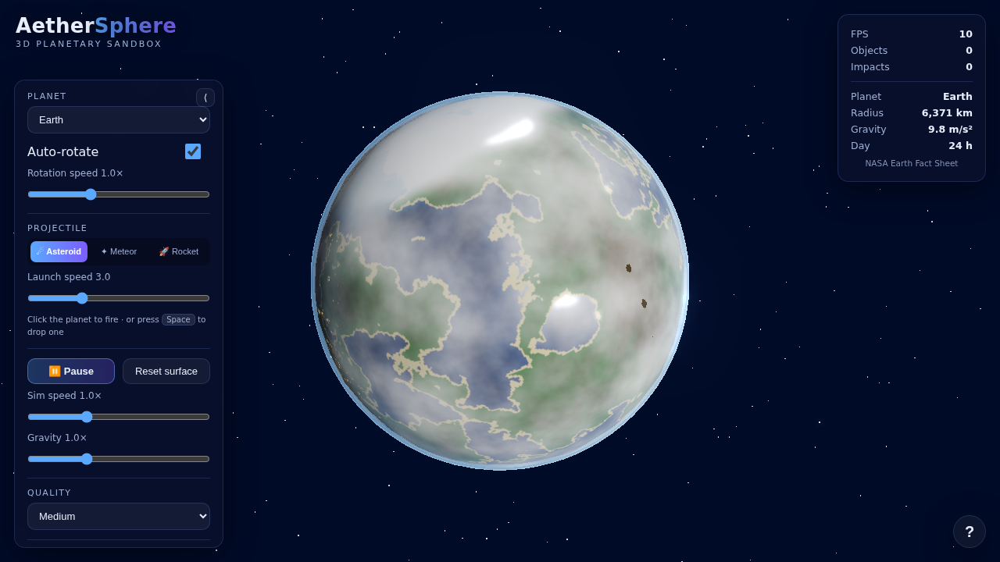
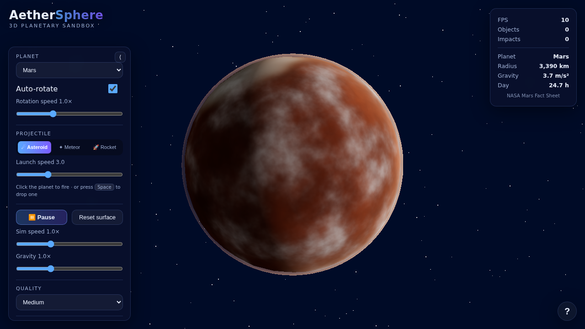
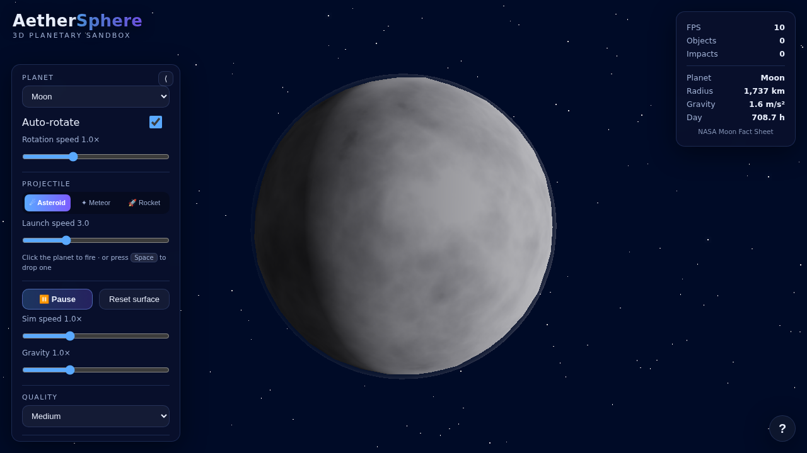
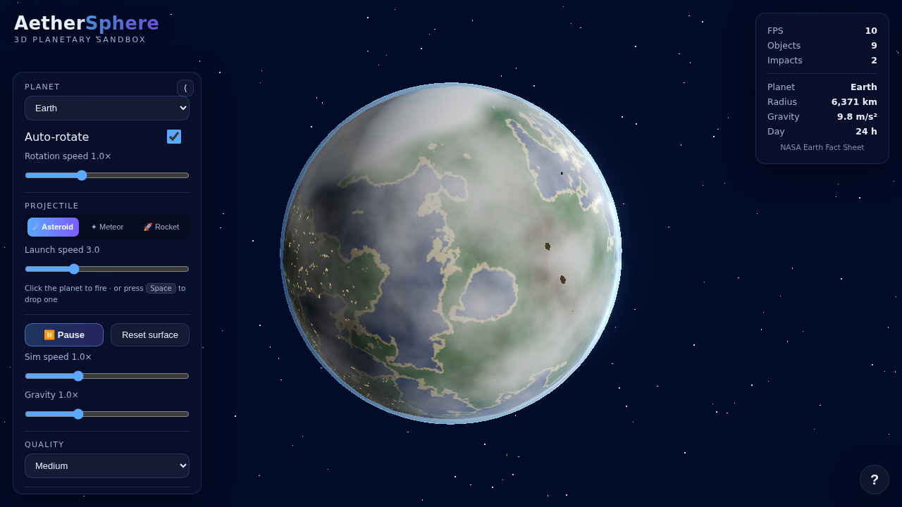

<div align="center">

# 🌍 AetherSphere

### A 3D Planetary Sandbox Simulator — *Google Earth meets planetary destruction*

Explore a procedurally generated, photoreal-styled planet floating in space, then unleash
asteroids, meteors, and rockets to watch realistic impacts, cratering, debris, and
**permanent surface deformation** unfold in real time — all in your browser, with zero
installation.

[**▶ Live Demo**](https://ryanjosephkamp.github.io/aether-sphere-claude-opus-4-8/)
·
[Features](#-features)
·
[Controls](#-controls)
·
[Development](#-development)
·
[Architecture](docs/ARCHITECTURE.md)



</div>

---

## ✨ Overview

AetherSphere is a 100% client-side WebGL experience built with [Three.js](https://threejs.org/)
and bundled with [Vite](https://vitejs.dev/). Everything you see is generated **procedurally at
runtime** — there are no shipped image/texture binaries to download, so the app loads fast and
the repository stays lightweight. It deploys automatically to GitHub Pages via GitHub Actions and
runs perfectly out of the box with **no manual setup, accounts, API keys, or external services**.

The three worlds — **Earth**, **Mars**, and the **Moon** — use factual physical data sourced from
the [NASA Planetary Fact Sheets](https://nssdc.gsfc.nasa.gov/planetary/factsheet/) (radius,
surface gravity, day length, axial tilt). See [docs/DATA-SOURCES.md](docs/DATA-SOURCES.md) for full
attribution.

| Earth | Mars | Moon |
| :---: | :---: | :---: |
|  |  |  |

## 🚀 Features

### 3D Planet Rendering
- Procedurally generated icosphere with fractal-Brownian-motion (fBm) + ridged-noise terrain.
- Runtime-generated day albedo, specular ocean/ice mask, and night city-lights textures.
- Custom GLSL day/night shader with a soft terminator, specular highlights, and emissive night lights.
- Smooth surface normals blended with screen-space relief normals so craters and mountains catch
  the light without faceting the globe.
- Animated cloud layer and physically inspired **atmospheric scattering glow**.
- Selectable planets: **Earth, Mars, Moon** — each with unique palette, atmosphere, and rotation.
- Automatic rotation with a toggle and adjustable speed.

### Camera & Interaction
- Smooth **orbit, zoom, and pan** controls with damping (mouse **and** touch).
- Click the planet to fire a projectile; press <kbd>Space</kbd> to drop one from orbit.

### Physics & Destruction
- World-space Newtonian physics with **inverse-square gravity**, semi-implicit Euler integration,
  and an atmospheric drag shell.
- Three projectile types — **☄ Asteroid, ✦ Meteor, 🚀 Rocket** (rockets self-propel on launch).
- On impact: **crater formation, fragment break-off, scattering debris with momentum, expanding
  shockwave ring, and a flash** — plus **permanent surface deformation** that persists and rotates
  with the planet.

### Simulation Controls
- Pause / play, adjustable simulation speed and gravity multiplier.
- Projectile type and launch-speed selection.
- **Reset surface** to repair all deformation.
- Quality presets (Low / Medium / High) that scale geometry detail, particle counts, and bloom.

### Save / Load
- **Save & Load** custom planetary states (including surface damage) to browser `localStorage`.
- **Export & Import** states as portable JSON files for sharing.

### UI & Polish
- Clean, modern glassmorphism overlay that never obstructs the 3D view.
- Live stats panel: FPS, active object count, impact count, and the NASA fact sheet for each world.
- Responsive layout for desktop and mobile; collapsible control panel; in-app help (<kbd>?</kbd>).



## 🎮 Controls

| Action | Input |
| --- | --- |
| Orbit camera | Left-click + drag · one-finger drag |
| Zoom | Mouse wheel · pinch |
| Pan | Right-click + drag · two-finger drag |
| Fire projectile at a point | Click the planet surface |
| Drop projectile from orbit | <kbd>Space</kbd> |
| Pause / resume simulation | <kbd>P</kbd> or the Pause button |
| Toggle help | <kbd>?</kbd> |
| Switch planet | Planet dropdown |
| Change projectile / speed | Projectile buttons + slider |

## 🧰 Tech Stack

| Concern | Choice |
| --- | --- |
| Rendering | [Three.js](https://threejs.org/) (WebGL) + custom GLSL shaders |
| Build tooling | [Vite](https://vitejs.dev/) |
| Tests | [Vitest](https://vitest.dev/) (jsdom) |
| Lint / format | [ESLint](https://eslint.org/) + [Prettier](https://prettier.io/) |
| CI/CD | GitHub Actions → GitHub Pages |
| Assets | 100% procedural — no binary textures shipped |

## 💻 Development

> Requires [Node.js](https://nodejs.org/) 20+.

```bash
# Install dependencies
npm install

# Start the dev server (http://localhost:5173)
npm run dev

# Run the unit test suite
npm test

# Lint and check formatting
npm run lint
npm run format:check

# Produce a production build in dist/
npm run build

# Preview the production build locally
npm run preview
```

Because AetherSphere is an ES-module application, use the dev server or a production build rather
than opening `index.html` from the filesystem. The **live GitHub Pages URL works instantly** with
no setup.

## ☁️ Deployment

Deployment is fully automated and **GitHub-native** (zero external cost):

1. On every push to `main`, the [`Deploy to GitHub Pages`](.github/workflows/deploy.yml) workflow
   builds the site and publishes `dist/` via `actions/deploy-pages`.
2. The [`CI`](.github/workflows/ci.yml) workflow lints, checks formatting, runs tests, and builds
   on every push and pull request.

To enable it on a fork: open **Settings → Pages**, set **Source: GitHub Actions**, then push to
`main`. The Vite `base` path is preconfigured for the project subpath.

## 🧪 Quality

- 45 unit tests covering math, noise, the heightfield deformation engine, physics integration,
  save/load serialization, and planetary configuration data.
- Lint-clean (ESLint) and consistently formatted (Prettier), enforced in CI.
- See [docs/QA-CHECKLIST.md](docs/QA-CHECKLIST.md) for the manual verification matrix.

## 📚 Documentation

- [docs/ARCHITECTURE.md](docs/ARCHITECTURE.md) — module map and rendering/physics design.
- [docs/DATA-SOURCES.md](docs/DATA-SOURCES.md) — NASA data attribution.
- [docs/QA-CHECKLIST.md](docs/QA-CHECKLIST.md) — quality-gate verification checklist.
- [docs/CONTRIBUTING.md](docs/CONTRIBUTING.md) — how to contribute.
- [IMPLEMENTATION-PLAN.md](IMPLEMENTATION-PLAN.md) · [PROGRESS.md](PROGRESS.md) · [CHANGELOG.md](CHANGELOG.md)

## 🙏 Credits & License

Planetary data © NASA (public domain) — see [docs/DATA-SOURCES.md](docs/DATA-SOURCES.md).
Built with Three.js and Vite. Released under the [MIT License](LICENSE).
